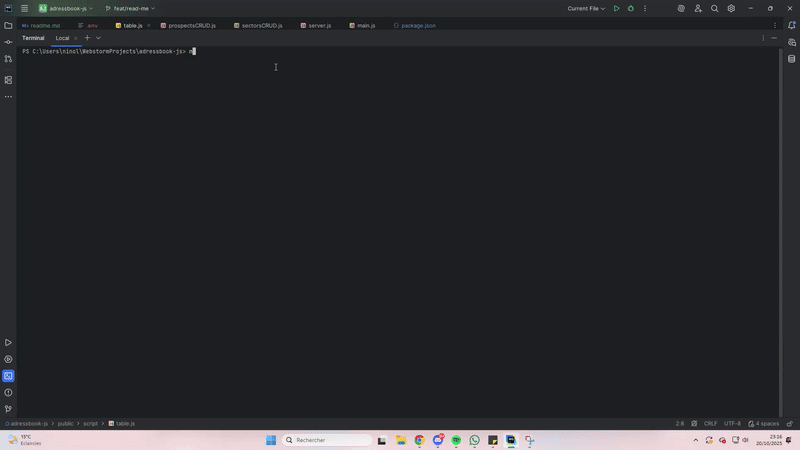

<p align="center">
  
</p>

---

## 📖 Table of contents

1. 🤔 [What is our address book?](#what-is-our-address-book)
2. ▶️ [Demo](#demo)
3. 🛠️ [How to use](#how-to-use)  
    3.1 🧰 [Dependencies](#dependencies)
    3.2 🔧 [environment variables](#environment-variables)
4. 🛜 [Run the server](#run-the-server)
5. 🗃️ [File Architecture](#file-architecture)
6. 🔮 [Features](#features)  
   6.1 ⌛ [Our API](#our-api)  
   6.2 🔊 [Our design](#our-design)
7. ✨ [Coming in the future](#coming-in-the-future)
8. ✅ [Good practices](#good-practices)
9. 🌐 [Credits](#credits)
10. 📎 [Appendix](#appendix)

---

## <a name="what-is-our-address-book"> 🤔 What is our address book?</a>

Our **Address Book** is a microservice designed as part of the Good Practices 
module. It is a lightweight web application that interacts seamlessly with 
an API to manage company prospects efficiently. Users can perform 
essential operations such as adding new prospects, deleting existing ones, 
and updating their information in real time.

The platform provides a clear and organized interface where users can view 
detailed information about each prospect, including their full name, 
city of residence, and key contact details such as email addresses and 
phone numbers. This ensures that all relevant information is easily 
accessible, helping the company maintain effective communication and a 
well-structured database.

Additionally, the Address Book emphasizes clean design and usability, 
allowing users to navigate effortlessly and perform their tasks quickly 
while following best practices in software development and microservice 
architecture.

---

## <a name="demo"> ▶️ Demo </a>

<div align="center">
    
</div>

---

## <a name="how-to-use"> 🛠️ How to use </a>

### <a name="dependencies"> 🧰 Dependencies </a>

To use our microservice you will need this on your machine :

[](https://git-scm.com/downloads)
[](https://nodejs.org/en/download)
[](https://docs.npmjs.com/downloading-and-installing-node-js-and-npm)


### Installation with git bash

```bash
git clone https://github.com/Ewoukouskous/adressbook-js.git
cd addressbook-js
npm install
```

### <a name="environment-variables"> 🔧 Environment variables </a>

We use environment variables to configure the server port and the 
paths to the two JSON databases. This approach ensures flexibility 
and security, allowing the application to adapt easily to different 
environments without changing the code.

Example : 

```
PORT=8080
PROSPECTS_DB_PATH=./data/db/prospects.json
SECTORS_DB_PATH=./data/db/sectors.json
```

---

## <a name="run-the-server"> 🛜 Run the server </a>

### Run the program with CLI
Run **Door Game** with the cmd using the command ``` npm start```

After that, open your web browser and go to [http://localhost:8080/](http://localhost:8080/) to use the address book.

The server will be hosted on your localhost address on the port **8080** or the port used into your .env

The 'Home Page' is the '/' route

> ❗A firewall warning may appear, be trustfully 😊 some firewall need that to host the server on your localhost address.

---

## <a name="file-architecture"> 🗃️ File Architecture </a>

```text
adressbook-js/
├── data/
│   ├── db/
│   │   ├── data.json
│   │   ├── prospects.json
│   │   └── sectors.json
│   └── node_modules/ (library root)
├── public/
│   ├── assets/
│   │   └── logo.png
│   ├── pages/
│   │   └── dashboard.html
│   └── script/
│       ├── data.js
│       ├── events.js
│       ├── main.js
│       ├── modals.js
│       ├── table.js
│       ├── ui.js
│       └── utils.js
├── readme-files/
│   ├── banner.png
│   └── demo.gif
├── src/
│   ├── utils/
│   │   ├── prospectsCRUD.js
│   │   ├── readJsonFile.js
│   │   └── sectorsCRUD.js
│   └── server.js
├── .env
├── LICENSE
├── package.json
├── package-lock.json
└── readme.md

```

---

## <a name="features"> 🔮 Features </a>

### <a name="our-api"> ⌛ Our API </a>

Our Address Book microservice interacts with the API through four main 
HTTP methods to manage prospects efficiently:

* **GET** – This command is used to retrieve all prospects from the database, 
allowing users to view the complete list of contacts at any time.

* **POST** – This method enables the addition of new prospects to the system, 
ensuring that new contacts are recorded accurately and quickly.

* **PATCH** – With this command, users can modify existing prospect 
information, such as updating contact details or changing other 
relevant data.

* **DELETE** – This method allows for the removal of prospects from the 
database, ensuring that outdated or unnecessary information can be 
efficiently cleaned up.

This API manages **prospects** stored in a local JSON database.  
Each prospect record includes contact and business information linked to a specific sector.

---

| Field             | Type   | Required  | Description |
|-------------------|--------|-----------|-------------|
| `id`              | number | auto      | Unique identifier for each prospect |
| `firstName`       | string | ✅         | Prospect’s first name |
| `lastName`        | string | ✅         | Prospect’s last name |
| `sectorWatchedId` | number | ✅         | ID of the watched sector (must exist in `sectors`) |
| `email`           | string | ✅         | Unique, valid email address |
| `phone`           | string | ✅         | French phone format (`+33 6XXXXXXXX` or `+33 7XXXXXXXX`) |
| `city`            | string | ✅         | City name |

---

### 🟩 GET `/api/prospects`

**Purpose:**
Retrieve all prospects from the database.

**Example request:**
```bash
curl -X GET http://localhost:8080/api/prospects
```

Response (200 – OK):

```json
[
  {
    "id": 1,
    "firstName": "Alice",
    "lastName": "Durand",
    "sectorWatchedId": 2,
    "email": "alice.durand@example.com",
    "phone": "+33612345678",
    "city": "Paris"
  },
  {
    "id": 2,
    "firstName": "Jean",
    "lastName": "Martin",
    "sectorWatchedId": 3,
    "email": "jean.martin@example.com",
    "phone": "+33787654321",
    "city": "Lyon"
  }
]
```

**Possible error codes:**

500 – JSON file not found or corrupted.

### 🟦 POST `/api/prospects`

**Purpose:**
Add a new prospect after validation and sanitization (via analyseAndSanitizeProspect()).

**Example request:**

```bash
curl -X POST http://localhost:8080/api/prospects \
-H "Content-Type: application/json" \
-d '{
  "firstName": "marie",
  "lastName": "leclerc",
  "sectorWatchedId": 1,
  "email": "marie.leclerc@example.com",
  "phone": "+33699887766",
  "city": "bordeaux"
}'
```
Response (201 – Created):

```json
{
  "message": "Prospect successfully created",
  "prospect": {
    "id": 3,
    "firstName": "Marie",
    "lastName": "Leclerc",
    "sectorWatchedId": 1,
    "email": "marie.leclerc@example.com",
    "phone": "+33699887766",
    "city": "Bordeaux"
  }
}
```

**Possible error codes:**

400 – Missing field (Field X is required)

400 – Invalid email format

400 – Duplicate email or phone

400 – Invalid or non-existing sectorWatchedId

### 🟨 PATCH `/api/prospects/:id`

**Purpose:**
Update specific prospect information.
Each field is validated and sanitized as needed.

**Example request:**

```bash
curl -X PATCH http://localhost:8080/api/prospects/2 \
-H "Content-Type: application/json" \
-d '{
  "email": "jean.martin@newmail.com",
  "city": "marseille"
}'
```

Response (200 – OK):

```json
{
  "message": "Prospect successfully updated",
  "prospect": {
    "id": 2,
    "firstName": "Jean",
    "lastName": "Martin",
    "sectorWatchedId": 3,
    "email": "jean.martin@newmail.com",
    "phone": "+33787654321",
    "city": "Marseille"
  }
}
```

**Possible error codes:**

400 – Invalid data type (Field X must be a string)

400 – No changes (Field X is the same as the current value)

400 – Invalid email format

400 – Duplicate email or phone

404 – Prospect not found

### 🟥 DELETE `/api/prospects/:id`

**Purpose:**
Delete a prospect by its ID.

**Example request:**

```bash
curl -X DELETE http://localhost:8080/api/prospects/2
```

Response (200 – OK):

```json
{
  "message": "Prospect with id 2 successfully deleted"
}
```
**Possible error codes:**

400 – Invalid ID (Prospect id is not a number)

404 – Prospect not found

500 – JSON write error

### <a name="our-design"> 🔊 Our design </a>

Our Address Book features a simple and intuitive design, making it 
easy for anyone to use. The clean layout ensures that all information 
is clearly visible, allowing users to navigate the application 
effortlessly and perform tasks quickly without confusion.

<p align="center">
  
</p>

## <a name="coming-in-the-future"> ✨ Coming in the future </a>

Future improvements we plan to implement:

* **Filters** : To enable faster and easier navigation through the list of prospects.
* **User Dashboard** : To provide an overview of current performance and user activity.

---

## <a name="credits"> 🌐 Credits </a>

- [@Amiard Renaud](https://github.com/Ramiard)
- [@Lefebvre Nino](https://github.com/Ewoukouskous)

---

## <a name="appendix"> 📎 Appendix </a>

- 🖼️[Project presentation](https://www.canva.com/design/DAG2XbWng5E/ObetAiUL7kEYNAhoKnFwhg/edit?utm_content=DAG2XbWng5E&utm_campaign=designshare&utm_medium=link2&utm_source=sharebutton)
- 🗃️[Github Repository](https://github.com/Ewoukouskous/adressbook-js.git)
